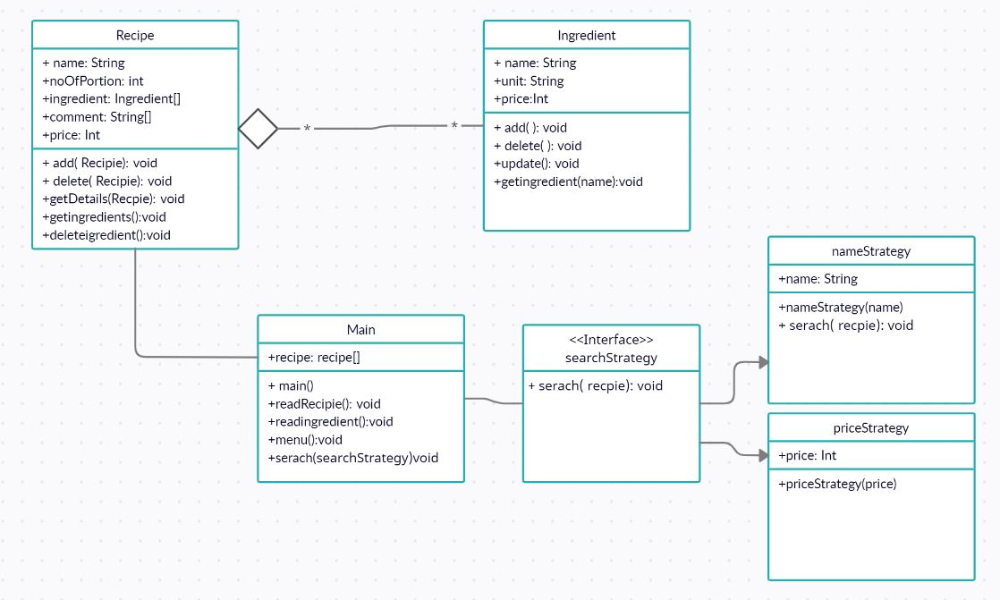

# Assignment #4 
# Class diagram 

# Implementation Detals
-Main class will read from file and store data in object list of reciepe and ingredients.
-Main class has search strategy patern for seraching reciepe.

-This design can be chnage as I go through my development. 