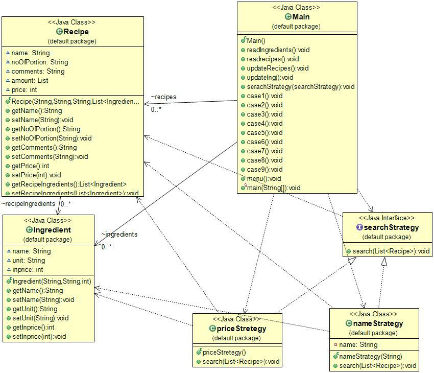
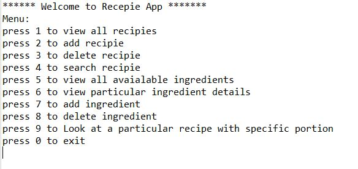
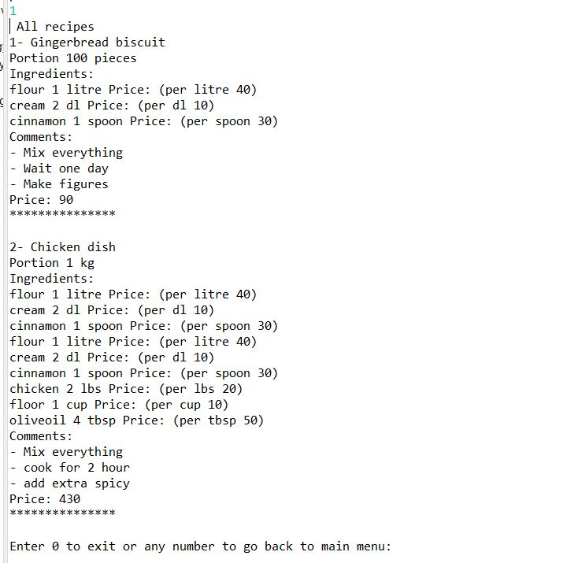
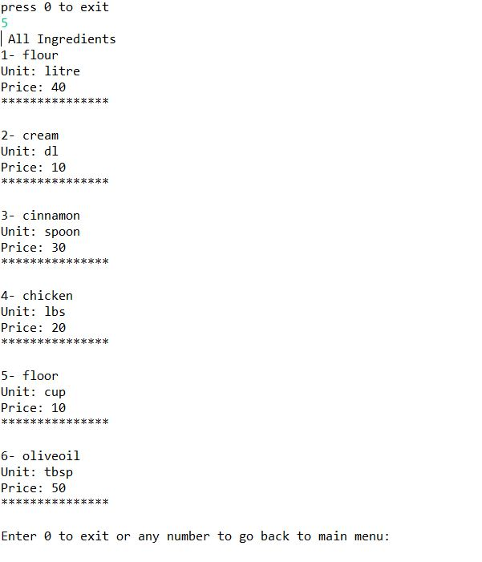
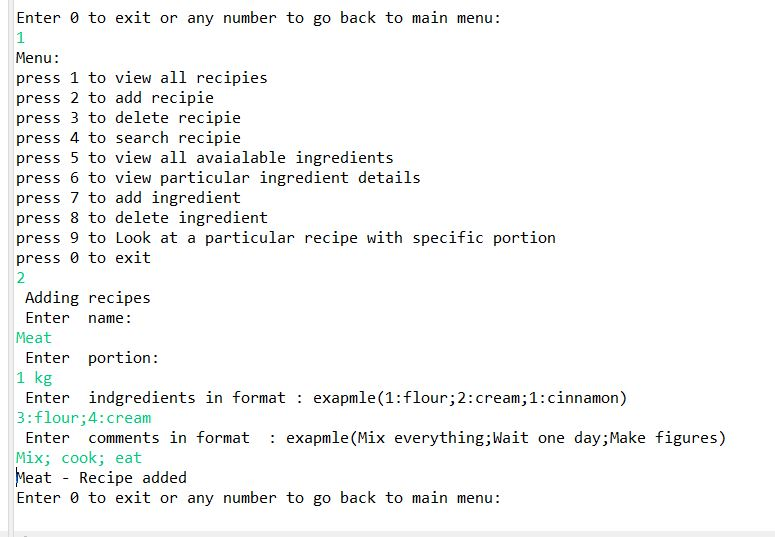
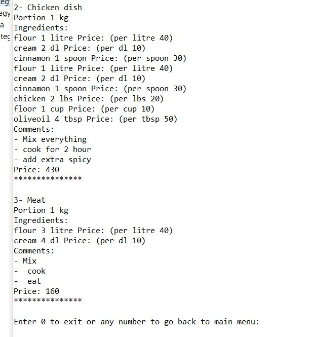
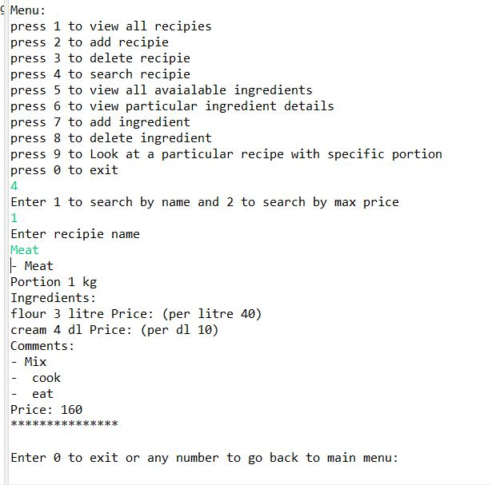
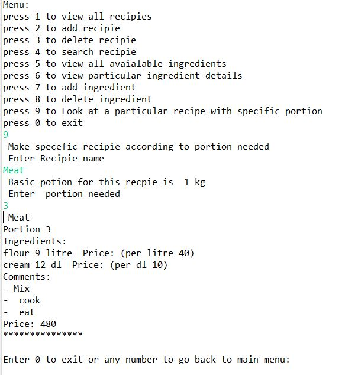
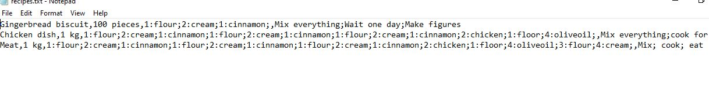

# Class diagram 

# Functionality Implemented
User can do following operations:
- view all recipies
- add recipie
- delete recipie
- search recipie
- view all avaialable ingredients
- view particular ingredient details
- to add ingredient
- to delete ingredient
- to Look at a particular recipe with specific portion

Files read as program starts and update as it terminates.

# To run

To run on your pc change path of files (recipes.txt and ingredients.txt) at line 18,40, 91,93,121,123 on Main.java file.

# Some screenshots

